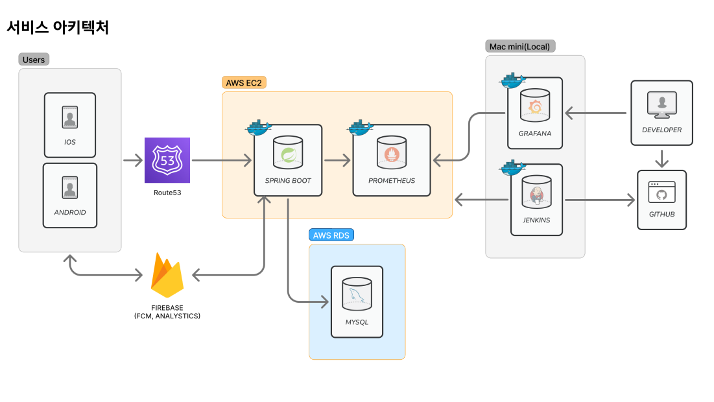

# YongJiBus-Backend

YongJiBus-Backend는 용지버스(YongJiBus) 서비스의 백엔드 API 서버입니다.
사용자에게 실시간 버스 도착 정보, 채팅, 셔틀버스 루트 정보 등 다양한 기능을 제공하며, 안정적이고 확장 가능한 시스템을 목표로 합니다.

## ✨ 주요 기능

*   **🚌 실시간 버스 정보:** ML 기반 노선별 셔틀 버스의 도착 정보 예측 (개발 중)
*   **👤 사용자 인증:** JWT 기반의 회원가입, 로그인, 이메일 인증을 지원합니다.
*   **💬 실시간 채팅:** WebSocket을 통해 사용자 간의 실시간 소통이 가능한 채팅방을 제공합니다.
*   **📅 운행일 관리:** 공공데이터 API와 연동하여 휴일 정보를 동기화하고, 버스 운행 시간을 구분합니다.
*   **🔔 푸시 알림:** Firebase Cloud Messaging(FCM)을 통해 사용자에게 알림을 전송합니다.
*   **🛡️ 사용자 신고:** 불건전 사용자를 신고하고 관리하는 기능을 제공합니다.

## 🛠️ 기술 스택

*   **Language:** Java 17
*   **Framework:** Spring Boot 3.3.4
*   **Database:** MySQL, H2 (for testing)
*   **Authentication:** Spring Security, JWT
*   **Chatting:** Spring WebSocket
*   **Cache:** Caffeine
*   **Push Notification:** Firebase Cloud Messaging (FCM)
*   **CI/CD:** Jenkins, Docker
*   **Monitoring:** Prometheus, Grafana

## 🏛️ 프로젝트 아키텍처



## 📱 프로젝트 화면
| 셔틀 시간표 기능 | 채팅 리스트 화면 | 채팅 화면 | 
|-----------|-----------|-----------|
|  |  |  
| 날자(평일/공휴일/방학)에 따른 <br>셔틀 시간 표시 및 광역버스 도착 정보 제공| 카풀 전용 채팅방 리스트 | 카풀 채팅 기능 |

## 📁 프로젝트 구조
ㄴ
```
src
└── main
    └── java
        └── com
            └── yongjibus
                ├── arrivaltime  # 셔틀 버스 도착 정보 (도착 예정 시간, 도착 예정 시간 오차)
                ├── auth         # 사용자 인증 (로그인, 회원가입)
                ├── chat         # 실시간 채팅
                ├── daytype      # 운행일 (평일, 주말, 공휴일) 관리
                ├── global       # 전역 설정 (보안, 에러 핸들링, CORS)
                ├── member       # 회원 정보 및 신고
                ├── scheduler    # 스케줄링 작업 (공휴일 정보 업데이트 등)
                └── vacation     # 운행 휴무 기간 관리
```

## 🚍 주요 기능 및 API

### 1. 인증/회원 관리

- **이메일 인증**: 학교 이메일(@mju.ac.kr)로 인증 코드 발송 및 검증
- **회원가입/로그인**: JWT 기반 인증, 토큰 갱신/로그아웃
- **회원 정보 조회**: 내 정보, 중복 확인, 논리적 삭제
- **신고 기능**: 사용자 신고

### 2. 채팅

- **채팅방 생성/참여/퇴장**: 실시간 채팅방 관리
- **메시지 전송/조회**: WebSocket(STOMP) 기반 실시간 메시지
- **FCM 알림**: 푸시 알림 토큰 등록/삭제

### 3. 운행일/방학 관리

- **운행일 유형**: 날짜별 평일/주말/공휴일 정보 제공
- **공휴일/달력 자동 갱신**: 외부 API 연동, 스케줄러로 자동화
- **방학 기간 관리**: 방학 기간 조회/설정


## 🚀 시작하기

### 전제 조건

*   Java 17 or higher
*   Gradle
*   MySQL Database

### 빌드 및 실행

1.  **저장소 복제:**
    ```bash
    git clone https://github.com/dogyungkim/YongJiBus-Backend.git
    cd YongJiBus-Backend
    ```

2.  **애플리케이션 설정:**
    `src/main/resources/application.yml` 파일을 열고, 실제 환경에 맞게 데이터베이스 연결 정보 및 기타 설정을 수정합니다.

3.  **프로젝트 빌드:**
    ```bash
    ./gradlew build
    ```

4.  **애플리케이션 실행:**
    ```bash
    java -jar build/libs/YongJiBus-0.0.1-SNAPSHOT.jar
    ```

---
